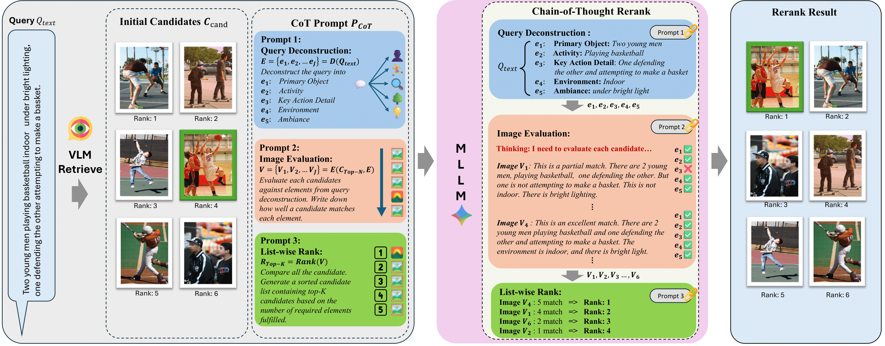

<div align="center">

# Chain-of-Thought Re-Ranking for Image Retrieval (CoTRR)

[](https://arxiv.org/abs/2509.14746)
[](LICENSE)



</div>

## Abstract

*[Image retrieval remains a fundamental yet challenging problem in computer vision. While recent advances in Multimodal Large Language Models (MLLMs) have demonstrated strong reasoning capabilities, existing methods typically employ them only for evaluation, without involving them directly in the ranking process. As a result, their rich multimodal reasoning abilities remain underutilized, leading to suboptimal performance.
In this paper, we propose a novel Chain-of-Thought Re-Ranking (CoTRR) method to address this issue. Specifically, we design a listwise ranking prompt that enables MLLM to directly participate in re-ranking candidate images. This ranking process is grounded in an image evaluation prompt, which assesses how well each candidate aligns with user's query. By allowing MLLM to perform listwise reasoning, our method supports global comparison, consistent reasoning, and interpretable decision-making—all of which are essential for accurate image retrieval. To enable structured and fine-grained analysis, we further introduce a query deconstruction prompt, which breaks down the original query into multiple semantic components.
Extensive experiments on five datasets demonstrate the effectiveness of our CoTRR method, which achieves state-of-the-art performance across three image retrieval tasks, including text-to-image retrieval (TIR), composed image retrieval (CIR) and chat-based image retrieval (Chat-IR).]*

---

## Methodology

The CoTRR framework operates as a second-stage re-ranking module that refines the initial candidate list provided by any standard retrieval model. The core of our method is a three-step Chain-of-Thought process executed by an MLLM.

1. **Query Deconstruction**: The initial user query (e.g., text for TIR, reference image and modification text for CIR) is decomposed into structured semantic components: *primary subject*, *activity*, *key details*, *environment*, and *ambiance*. This provides a fine-grained, interpretable representation of user intent.

2. **Image Evaluation**: Each candidate image is assessed against the deconstructed query components. Instead of a simple binary judgment, the MLLM provides a detailed textual explanation and an overall qualitative judgment (e.g., "excellent match", "partial match"), offering rich, informative insights for ranking.

3. **Listwise Ranking**: The MLLM performs a global comparative analysis of all candidate evaluations to generate a final, sorted list. This one-stage process preserves consistent reasoning and facilitates globally informed ranking decisions, which are critical for improving retrieval performance.

---

## Key Results

CoTRR establishes a new state-of-the-art across five benchmark datasets and three retrieval tasks.

* [cite_start]**Composed Image Retrieval (CIR)**: On CIRR, CoTRR with a ViT-B/32 backbone achieves a **50.84%** R@1, an absolute improvement of **12.41%** over the strong ImageScope baseline. [cite: 145]

* [cite_start]**Text-to-Image Retrieval (TIR)**: On Flickr30K and MSCOCO, CoTRR consistently outperforms both the base CLIP model and ImageScope, achieving an average R@1 of **73.37%** with a ViT-L/14 backbone. [cite: 146]

* [cite_start]**Chat-based Image Retrieval (Chat-IR)**: On VisDial, CoTRR significantly outperforms prior methods across all dialogue rounds, achieving a **10.56%** improvement in Hits@10 in the first round compared to ImageScope. [cite: 231]

---

## Setup

### 1. Clone Repository

```bash
git clone [https://github.com/freshfish15/CoTRR.git](https://github.com/freshfish15/CoTRR.git)
cd CoTRR
```

### 2. Install Dependencies

We recommend using Conda for environment management.

```bash
# Create and activate a new conda environment (e.g., named 'cotrr')
conda create -n cotrr python=3.12 -y
conda activate cotrr

# Install the required packages
pip install -r requirements.txt
```

### 3. Configure API Keys

API keys and model configurations are located in `models/configs/config.py`. Replace the placeholder values with your credentials.  
**Tip:** For security, use environment variables to manage sensitive keys.

### 4. Download Datasets

Create a top-level `datasets/` directory and organize the data as specified in the project structure.  
The `main.py` script expects paths relative to this directory.

---

## Usage

All evaluation pipelines are executed through `main.py`. Use the `-h` flag to view all available commands and task-specific arguments.

```bash
python main.py -h
```

### Composed Image Retrieval (CIRR)

To evaluate on the CIRR dataset in subset mode with MLLM reranking:

```bash
python main.py cirr \
    --input_json_path ./datasets/cirr/annotations/captions.json \
    --image_dir ./datasets/cirr/dev \
    --mode subset \
    --model CLIP \
    --rerank \
    --num-workers 8
```

### Text-to-Image Retrieval (MSCOCO)

To evaluate on the MSCOCO 5k test set with a CLIP retrieval model and MLLM reranking:

```bash
python main.py mscoco \
    --csv_path ./datasets/mscoco/annotations/mscoco_test.csv \
    --image_dir ./datasets/mscoco/val2014 \
    --model CLIP \
    --rerank \
    --num-workers 8 \
    --rerank-workers 16
```

### Chat-based Image Retrieval (VisDial)

To evaluate on the VisDial validation set with reranking:

```bash
python main.py visdial \
    --json_path ./datasets/visdial/visdial_1.0_val.json \
    --image_dir ./datasets/visdial/VisualDialog_val2018 \
    --model CLIP \
    --rerank \
    --num-workers 4
```

---

## Citation

If you find our work useful in your research, please consider citing our paper:

```bibtex
@article{wu2025chain,
    title={Chain-of-Thought Re-ranking for Image Retrieval Tasks},
    author={Wu, Shangrong and Zhou, Yanghong and Chen, Yang and Zhang, Feng and Mok, PY},
    journal={arXiv preprint arXiv:2509.14746},
    year={2025}
}
```
